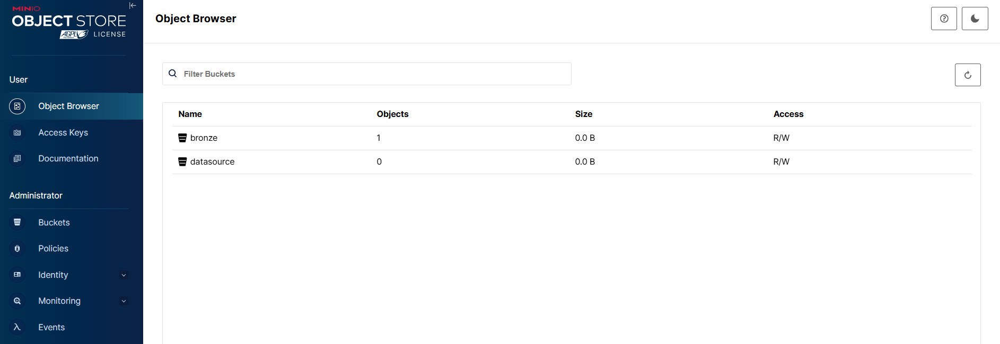
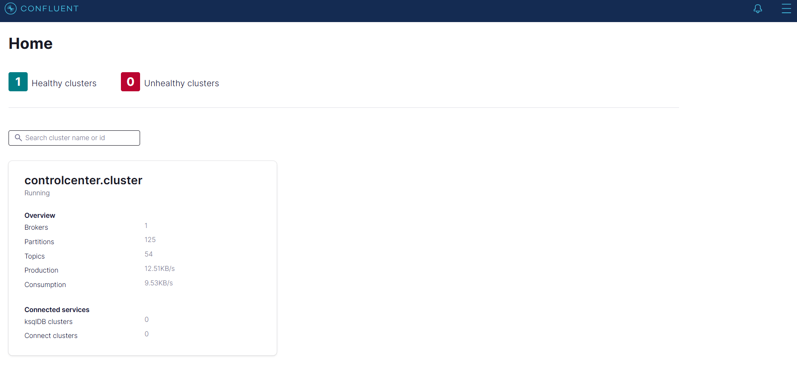
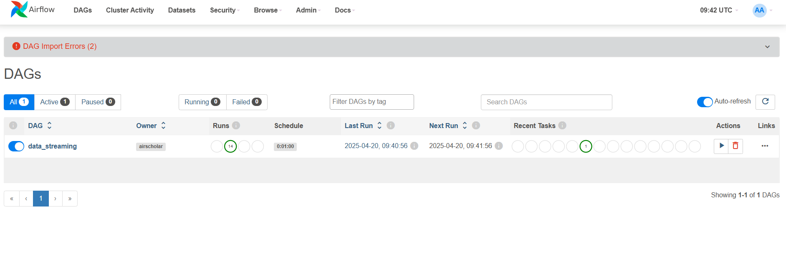
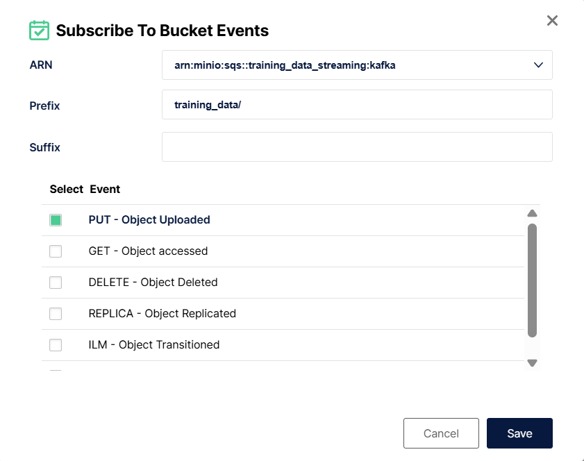
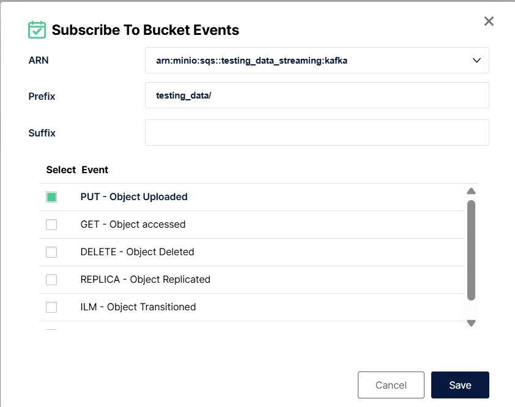

# Realtime Data Streaming Pipeline

Hệ thống xử lý dữ liệu thời gian thực sử dụng Apache Airflow, Kafka, Spark, PostgreSQL và MinIO. 
Dự án này giả lập quá trình xử lý dữ liệu theo thời gian thực từ nhiều nguồn dữ liệu.

## Yêu cầu hệ thống
- Docker và Docker Compose
- Python 3.9+
- Kết nối internet ổn định

## Kiến trúc hệ thống
Hệ thống bao gồm các thành phần chính:
- **MinIO**: Lưu trữ object storage cho dữ liệu nguồn và datalake
- **Kafka & Confluent Platform**: Hệ thống message broker
- **Apache Airflow**: Điều phối luồng xử lý dữ liệu
- **Apache Spark**: Xử lý dữ liệu phân tán
- **PostgreSQL**: Lưu trữ dữ liệu quan hệ và metadata
- **Redis**: Lưu trữ key-value cho dữ liệu thời gian thực

## Hướng dẫn triển khai

### Bước 1: Khởi tạo môi trường MinIO
1. Tạo Docker network cho hệ thống:
   ```bash
   docker network create confluent
   ```

2. Triển khai MinIO:
   ```bash
   docker-compose -f docker-compose-minio.yml up -d
   ```

3. Truy cập MinIO Web UI tại `http://localhost:9001`:
   - **Username**: `minioadmin`
   - **Password**: `minioadmin`

4. Cấu hình MinIO:
   - Hai bucket sẽ được tạo tự động: `bronze` (datalake) và `storage` (data source)
   - Tạo Access Keys từ giao diện quản trị MinIO (Administrator → Access Keys → Create new key)
   - Cập nhật thông tin access key và secret key vào file `/datalake/minio_config.py`

   
   

### Bước 2: Khởi tạo dữ liệu nguồn
Tạo dữ liệu mẫu cho việc giả lập nguồn dữ liệu:

```bash
python datalake/load_to_storage.py
```

Kết quả:
- Bucket `storage` sẽ chứa hai thư mục:
  - `training_data`: Chứa file parquet (tổng hợp dữ liệu từ CSV theo giờ)
  - `testing_data`: Chứa file JSON (mỗi dòng trong CSV tương ứng với một file JSON)


### Bước 3: Triển khai hệ thống xử lý dữ liệu
1. Khởi động các dịch vụ chính (Kafka, Airflow, Spark, PostgreSQL):
   ```bash
   docker-compose up -d
   ```

2. Đợi webserver khởi động hoàn tất, sau đó khởi động lại scheduler:
   ```bash
   docker-compose up -d
   ```
   > **Lưu ý**: Scheduler có thể bị dừng nếu khởi động trước khi webserver sẵn sàng, vì vậy cần khởi động lại sau khi webserver đã hoạt động.

3. Truy cập các giao diện quản trị:
   - **Kafka Control Center**: `http://localhost:9021`
   - **Apache Airflow**: `http://localhost:8080` (username: `admin`, password: `admin`)

   
   

### Bước 4: Cấu hình Lambda ở MinIO

1. Cấu hình Event cho `training_data_streaming`:
   - Tại Administrator: Events → Add Event Destination → Kafka, và cấu hình như ở ảnh dưới (Identifier: `training_data_streaming`, Brokers: `broker:29092`, Topic: `training_data_streaming`)

   

2. Cấu hình Event cho `testing_data_streaming`:
   - Tại Administrator: Events → Add Event Destination → Kafka, và cấu hình như ở ảnh dưới (Identifier: `testing_data_streaming`, Brokers: `broker:29092`, Topic: `testing_data_streaming`)

   

3. Kết nối 2 Events vừa tạo trên cho `bronze` bucket:
   - Administrator: Buckets → bronze → Events → Subscribe to Event. Thực hiện Subscribe 2 lần tương ứng với 2 luồng (training/testing) sẽ đi vào các Topic khác nhau của Kafka.

   
   

4. Tại Apache Airflow Web, thực hiện Trigger cả 2 Dags và vào lại Kafka Controller Web, chọn xem Topics thì sẽ thấy 2 Topics vừa tạo ở phần Cấu hình Event xuất hiện. 2 Topics nhận các Messages khác nhau đến từ 2 luồng.

   
   
   

### Bước 5: Khởi động Spark

#### Bước 5.1: Khởi động Spark đối với `testing_data_streaming`, xử lý và chuyển dữ liệu vào Redis
1. Truy cập vào Spark Master Terminal:
   ```bash
   docker exec -it spark-master bash
   ```
2. Cài đặt những thứ cần thiết:
   ```bash
   Exec docker -it spark-mater pip install spark-requirement.txt
   ```
3. Chạy Spark:
   Chạy dữ liệu vào Redis:
   ```bash
   /opt/bitnami/spark/bin/spark-submit \
       --master spark://spark-master:7077 \
       --packages org.apache.spark:spark-sql-kafka-0-10_2.12:3.4.1,org.apache.hadoop:hadoop-aws:3.3.4,com.amazonaws:aws-java-sdk-bundle:1.12.262 \
       /opt/spark_app/testing_data_streaming.py
   ```
3. Sau khi Spark đã cài xong các file cấu hình liên quan và thực hiện xử lý, để kiểm tra xem data có đi vào Redis như kỳ vọng hay không:
   ```bash
   docker exec -it redis redis-cli 
   HGETALL "session:f2c45be2-c4cf-4caf-9c40-eaf0634b80dc:product:1307353"
   ```
   (Dữ liệu lưu vào Redis theo định dạng key-value, truy vấn theo Key)

#### Bước 5.2: Khởi động Spark để xử lý dữ liệu training
   1. Chạy dữ liệu vào PostGre:
   ```bash
   conda install -c anaconda setuptools
   ```
   
   2. Cách vào postgres xem dữ liệu: 

   ```bash
      docker exec -it postgres psql -U airflow -d airflow
   ```

   3. Sau đó nhập các lệnh sql để truy vấn bảng processed_data:
   ```bash
   SELECT * FROM processed_data LIMIT 10;
   SELECT COUNT(*) FROM processed_data;
   ```

