# Data Streaming ETL & MLOps

Dự án hướng tới giả lập quá trình xử lý dữ liệu (ETL) theo thời gian thực từ nhiều nguồn dữ liệu, từ đó kết hợp với nền tảng MLOps cho phép đưa ra đề xuất, dự đoán theo thời gian thực.

## Yêu cầu hệ thống
- Docker và Docker Compose
- Python 3.9+, minio, pyarrow, pandas

## Kiến trúc hệ thống
Data pipeline:
- **MinIO**: Cơ sở dữ liệu cho dữ liệu nguồn và datalake
- **Kafka & Confluent Platform**: Hệ thống message broker
- **Apache Airflow**: Điều phối luồng xử lý dữ liệu
- **Apache Spark**: Xử lý dữ liệu phân tán
- **PostgreSQL**: Lưu trữ dữ liệu quan hệ và metadata
- **Redis**: Lưu trữ key-value cho dữ liệu thời gian thực

Training pipeline:
- **MLFlow**:
- **Ray**:

## Hướng dẫn triển khai

### Bước 1: Khởi tạo môi trường MinIO
1. Tạo Docker network cho hệ thống:
   ```bash
   docker network create confluent
   ```

2. Triển khai MinIO:
   ```bash
   docker-compose -f docker-compose-minio.yml up -d
   ```

3. Truy cập MinIO Web UI tại `http://localhost:9001`:
   - **Username**: `minioadmin`
   - **Password**: `minioadmin`

4. Cấu hình MinIO:
   - Hai bucket sẽ được tạo tự động: `bronze` (datalake) và `datasource` (data source)
   - Trong `bronze` sẽ tồn tại: `_checkpoints\data_streaming` để phục vụ cho pha Spark streaming.
   - Tạo Access Keys từ giao diện quản trị MinIO (Administrator → Access Keys → Create new key)
   - Cập nhật thông tin access key và secret key vào file `/data_source/minio_config.py`

   
   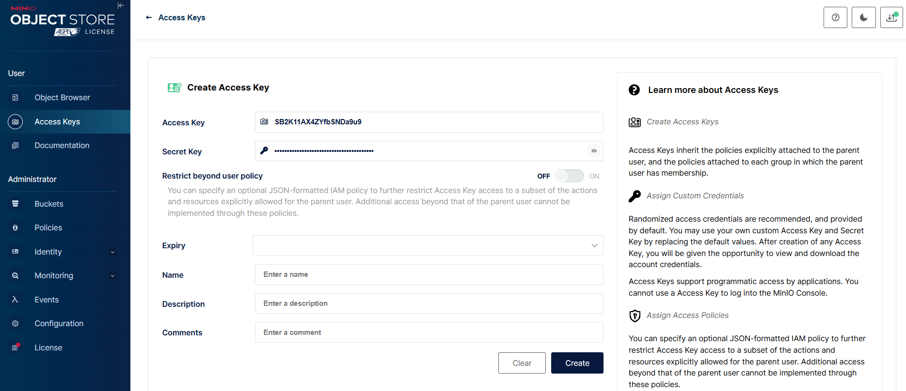

### Bước 2: Khởi tạo dữ liệu nguồn
Chuyển dữ liệu từ .csv vào `datasource` để tạo nguồn dữ liệu, phục vụ cho data streaming:

```bash
python data_source/load_to_source.py
```

Kết quả:
- Bucket `datasource` sẽ chứa các đối tượng JSON được chuyển đổi từ các hàng trong `.csv` gốc ban đầu.

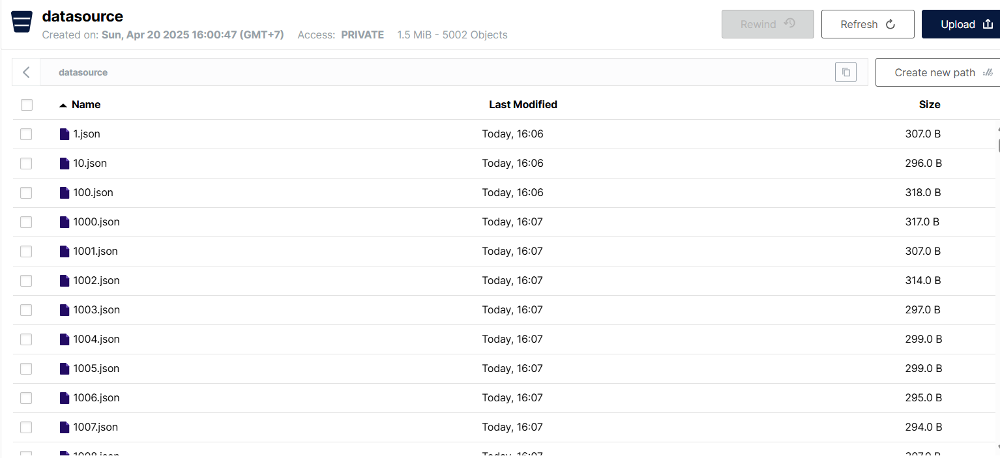

### Bước 3: Triển khai hệ thống xử lý dữ liệu
1. Khởi động các dịch vụ chính (Kafka, Airflow, Spark, PostgreSQL):
   ```bash
   docker-compose up -d
   ```
   Ghi chú hữu ích:
      Tìm tiến trình đang chiếm công 8080: netstat -aon | findstr :8080
      Xóa tiến trình: taskkill /PID <PID của tiến trình tìm được ở trên> /F

2. Đợi webserver khởi động hoàn tất, sau đó khởi động lại scheduler:
   ```bash
   docker-compose up -d
   ```
   > **Lưu ý**: Scheduler có thể bị dừng nếu khởi động trước khi webserver sẵn sàng, vì vậy cần khởi động lại sau khi webserver đã hoạt động.

3. Truy cập các giao diện quản trị:
   - **Kafka Control Center**: `http://localhost:9021`
   - **Apache Airflow**: `http://localhost:8080` (username: `admin`, password: `admin`)

   
   

### Bước 4: Cấu hình Lambda ở MinIO

1. Cấu hình Event tại MinIO:
   - Tại MinIO/Administrator: Events → Add Event Destination → Kafka, và cấu hình như ở ảnh dưới (Identifier: `data_streaming`, Brokers: `broker:29092`, Topic: `data_streaming`)

   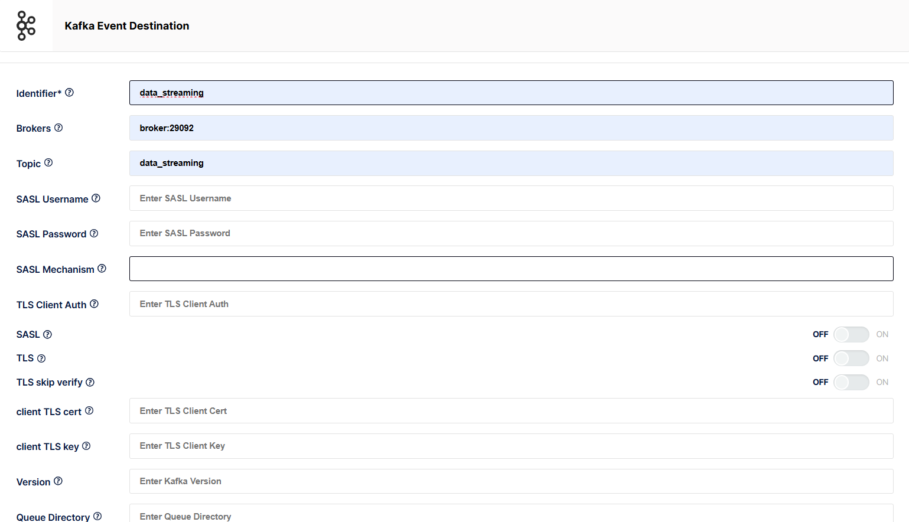

2. Kết nối Event vừa tạo trên cho `bronze` bucket:
   - Administrator: Buckets → bronze → Events → Subscribe to Event. Và thực hiện như ở ảnh dưới:

   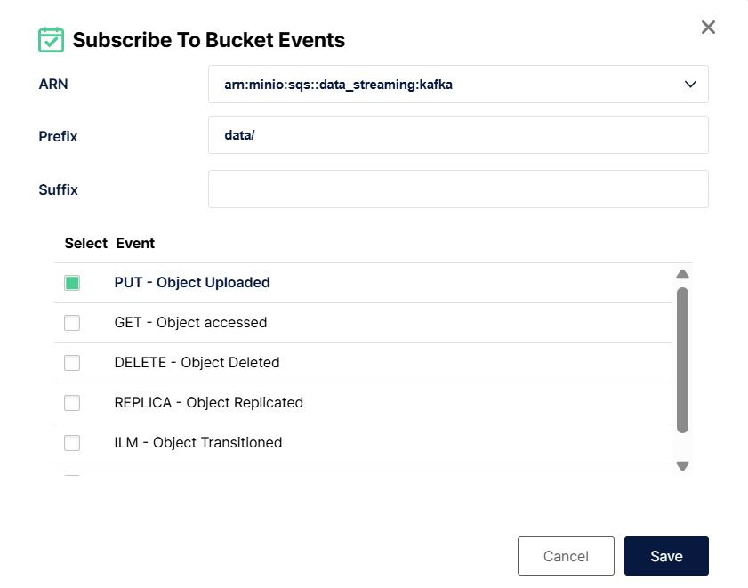

3. Tại Apache Airflow Web (`http://localhost:8080/`), thực hiện Trigger `data_streaming` và xem kết quả. Dữ liệu sẽ được lấy từ `datasource` chuyển vào `bronze/data` và tín hiệu sẽ được chuyển vào topic `data_streaming` ở Kafka (`http://localhost:9021/`)

   
   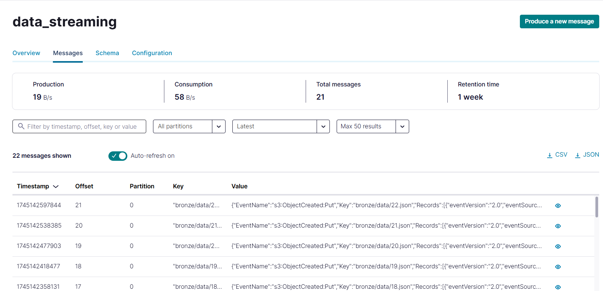

### Bước 5: Khởi động Spark, thực hiện chuyển đổi, xử lý và truyền dữ liệu vào Redis
1. Truy cập vào Spark Master Terminal:
   ```bash
   docker exec -it spark-master bash
   ```
3. Chạy Spark:
   Chạy dữ liệu vào Redis:
   ```bash
   /opt/bitnami/spark/bin/spark-submit \
      --master spark://spark-master:7077 \
      --jars /opt/spark_app/jars/spark-sql-kafka-0-10_2.12-3.4.1.jar,/opt/spark_app/jars/hadoop-aws-3.3.4.jar,/opt/spark_app/jars/kafka-clients-3.3.2.jar,/opt/spark_app/jars/commons-pool2-2.11.1.jar,/opt/spark_app/jars/spark-token-provider-kafka-0-10_2.12-3.4.1.jar \
      /opt/spark_app/process_data_streaming.py
   ```
3. Sau khi Spark đã cài xong các file cấu hình liên quan và thực hiện xử lý, để kiểm tra xem data có đi vào Redis như kỳ vọng hay không:
   - Kiểm tra số lượng phần tử trong Redis:
   ```bash
   docker exec -it redis redis-cli DBSIZE
   ```
   - Kiểm tra giá trị tại một phần tử với key được chỉ định:
   ```bash
   docker exec -it redis redis-cli HGETALL "user:571535080:product:12300394"
   ```
   (Dữ liệu lưu vào Redis theo định dạng key-value, truy vấn theo Key)
# Development stage
   1. Chạy docker
   ```bash
   docker-compose -f docker-compose.ray.yaml up -d
   docker-compose -f docker-compose.model-registry.yaml up -d
   ```
   2. Truy cập địa chỉ:
   - Ray Dashboard: http://localhost:8265/#/overview
   - MLflow dashboard: http://localhost:5001/

# Production stage
1. Start the Inference API (if bugged)
   ```bash
   docker-compose up -d inference-api
   ```
2. Using the Swagger UI:
- Test root endpoints: 
   ```bash
   curl http://localhost:8000/
   ```
- Using Swagger UI:
   + Open a web browser and navigate to: http://localhost:8000/docs
   + You'll see the FastAPI Swagger interface
   + Click on the /predict endpoint
   + Click "Try it out"
   + Enter the sample request JSON
      [
         {
            "user_id": 571535080,
            "product_id": 12300394
         }, 
         {
            "user_id": 554617586,
            "product_id": 28713252
         }
      ]
   + Click "Execute"
3. Tracking services
   3.1. Setup Prometheus and Grafana
   - Khởi động các service
   ```bash
   docker-compose up -d prometheus grafana inference-api
   ```
   3.2. Truy cập các trang web sau:
   - Prometheus: http://localhost:9091
   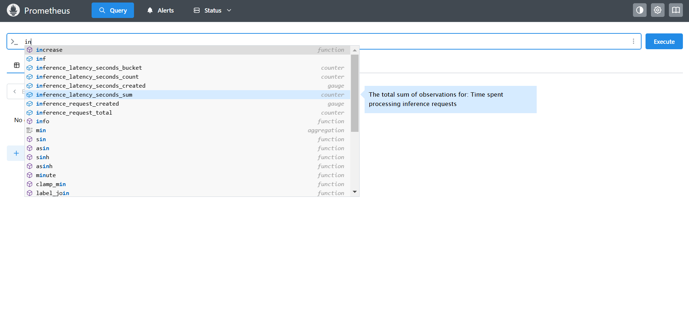
   Muốn xem metric nào thì gõ vào query rồi bấm execute để xem lại tracking. Hiện tại chỉ đang track các metric liên quan đến inference nên có thể bấm Execute inference nhiều lần trong localhost:8000/docs; rồi lại reload lại trang để xem sự thay đổi của graph Prometheus.
   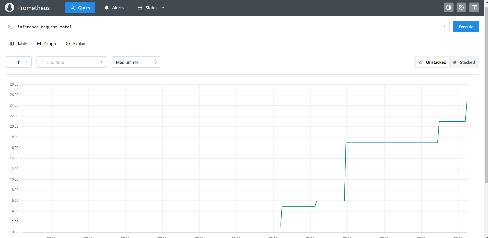
   - Grafana: http://localhost:3000/. (username: admin, password: admin)
   - Nơi ghi lại metric từ inference các request: http://localhost:8000/metrics. Sau khi đăng nhập, bấm vào mục data source nên có một data source từ Prometheus như hình dưới (Prometheus để tracking còn Grafana để visualize toàn diện hơn) do đã set up trong file: "monitoring\grafana\provisioning\datasources\datasource.yml"
   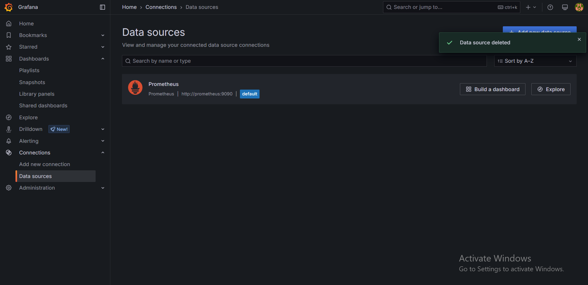
   Bấm vào home tạo dashboard mới, xong vào dashboard để visualizing bằng cách bấm nút add visualization
   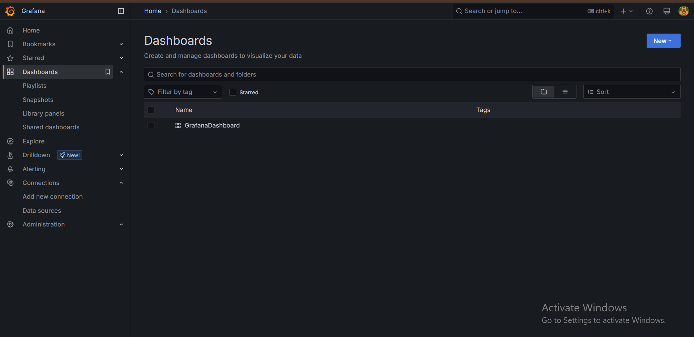
   Do đã có sẵn 1 visualization/ 1 panel nên sẽ bấm như dưới
   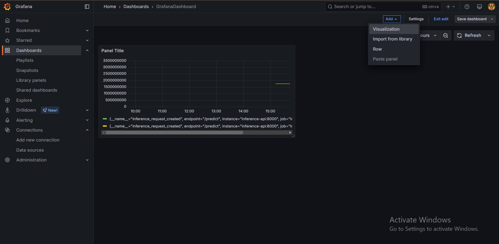
   Xong chọn metric của việc inference muốn visualize: 
   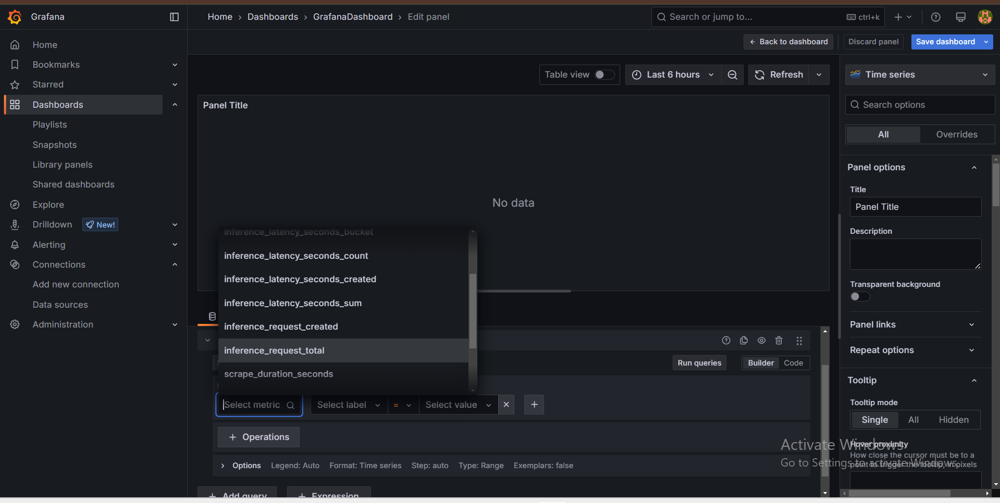
   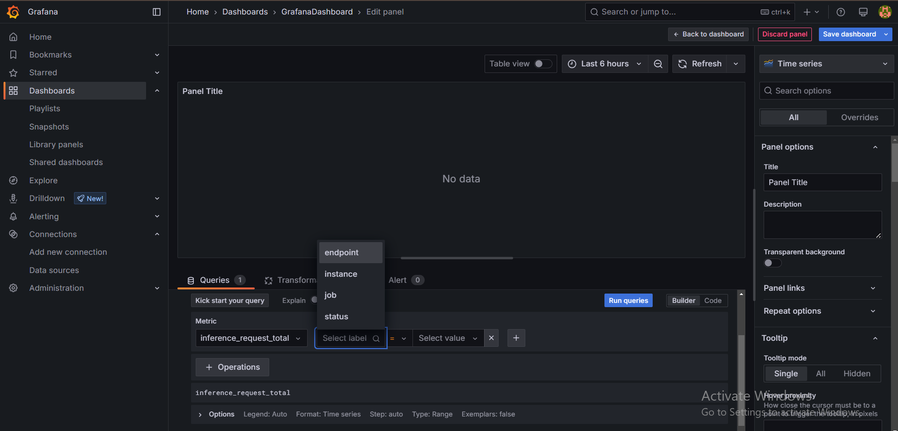
   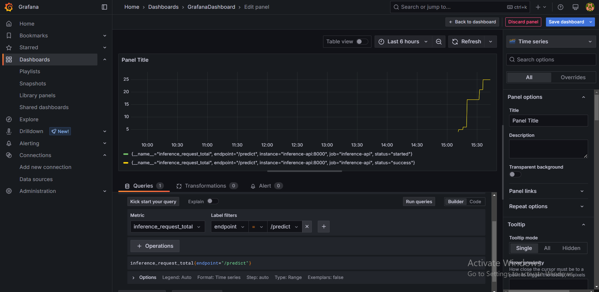
